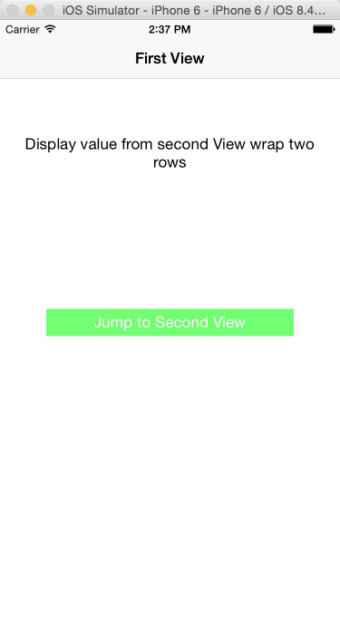
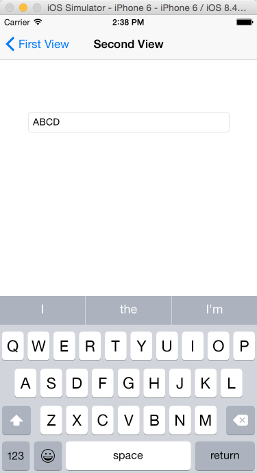
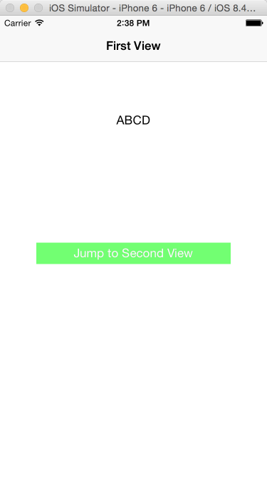

# BlockTransferValue
通过block，Second View 返回把 Textfield 的值带回道 First View.

## Where I learn? You can do it absolutely.
[iOS开发：使用Block在两个界面之间传值(Block高级用法：Block传值)](http://winann.blog.51cto.com/4424329/1438480?utm_source=tuicool)[一毛
]

 
 
