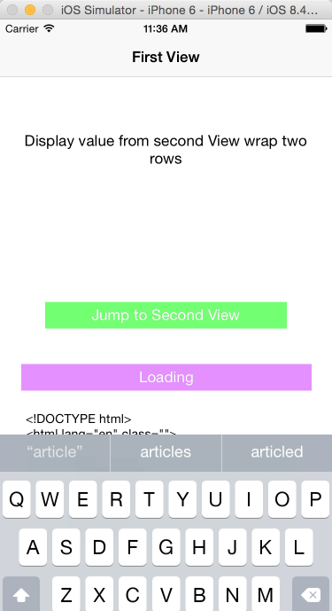

# BlockTransferValue
###1. 通过block，Second View 返回把 Textfield 的值带回道 First View.

  
###2. NSOpration，GCD分别实现loading web view code的过程，中间有indicator animating，列举所有GCD系统提供的dispatch method, 推出到后台以后用GCD实现10分钟驻留  
 
 
###3. 用UIControl，UITapGestureRecognizer实现键盘隐藏 
  

## Where I learn? You can do it absolutely.
[iOS开发：使用Block在两个界面之间传值(Block高级用法：Block传值)](http://winann.blog.51cto.com/4424329/1438480?utm_source=tuicool)[一毛
]  
[使用GCD](http://blog.devtang.com/blog/2012/02/22/use-gcd/)[唐巧的技术博客]  
[IOS 点击空白处隐藏键盘的几种方法](http://blog.csdn.net/swingpyzf/article/details/17091567)[SwingLife的专栏]

 
 
